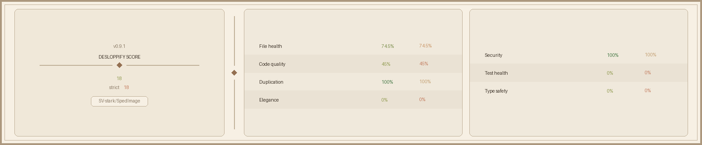

<p align="center">
  
</p>

<h1 align="center">🖼️ SpedImage</h1>

<p align="center">
  <strong>Ultra-Lightweight, GPU-Accelerated Image Viewer with Native Performance.</strong>
</p>

<p align="center">
  <a href="#"></a>
  <a href="#"></a>
  <a href="#"></a>
  <a href="LICENSE"></a>
</p>

<p align="center">
  SpedImage is a high-performance, cross-platform image viewer rebuilt in <strong>Rust</strong> with <strong>WGPU</strong> for GPU-accelerated rendering. It provides memory-safe, zero-copy image processing with real-time adjustments.
</p>

## 📋 Table of Contents
- [Key Features](#-key-features)
- [Format Support](#-format-support)
- [Usage & CLI](#-usage--cli)
- [Building from Source](#-building-from-source)
- [Project Architecture](#-project-architecture)
- [Keyboard Shortcuts](#-keyboard-shortcuts)
- [Contributing](#-contributing)

---

<h2 align="center">🚀 Key Features</h2>

### ⚡ High-Performance Image Loading
- **Memory Efficient**: Zero-copy GPU texture loading ensures minimal RAM usage.
- **Fast Startup**: Native performance without heavy web or electron frameworks.

### 🎨 GPU-Accelerated Editing
All adjustments are applied in real-time using **WGPU Shaders**—no CPU processing required.
- **Instant Adjustments**: Brightness, Contrast, and Saturation work instantly on 4K/8K images.
- **HDR Toning**: Real-time **Filmic Reinhard** tone-mapping for cinematic contrast (`H`).
- **Lossless Rotation**: Shader-based rotation (90° increments).
- **Crop**: Crop regions using smooth zoom and pan.
- **Save & Export**: Save your edits effortlessly (`Ctrl+S`).

---

<h2 align="center">🖼️ Format Support</h2>

<div align="center">

| Format | Decoding Engine | OS Support |
|--------|-----------------|------------|
| JPEG, PNG, GIF, BMP, TIFF, WebP | Pure Rust (`image` crate) | All Platforms |
| RAW (CR2, NEF, ARW, DNG, etc.) | `rawler` crate + WIC fallback | All Platforms |
| SVG | `resvg` crate | All Platforms |
| HEIC / AVIF | Native OS Codecs (WIC) | Windows Only* |

*\* On Windows, HEIC/AVIF requires the appropriate HEVC/HEIF extensions installed from the Microsoft Store.*

</div>

---

<h2 align="center">⚡ Performance Benchmarks</h2>

<p align="center">
  Based on a typical consumer system (e.g., Apple M1 or Intel i7 + mid-range GPU). Times and memory usage are approximate and depend heavily on image resolution.
</p>

<div align="center">

| Operation | Typical Latency | CPU Usage | Memory Impact | 
|-----------|-----------------|-----------|---------------|
| **Cold Start to Render** | < 100ms | Spike on load | Base app size (~10MB) |
| **Decoding (e.g., 24MP JPEG)** | 50-150ms | Multi-core spike | Dependent on image res |
| **GPU Upload (Zero-Copy)** | < 5ms | Near Zero | Video RAM mapped directly |
| **HDR Toning (Filmic)** | 0.0ms (0 CPU) | Zero | None |
| **Smooth Crop/Zoom Animation** | 60 FPS | Nominal (< 2%) | None |
| **Brightness/Contrast Adjust** | 0.0ms (0 CPU) | Zero | None |

</div>

---

## 💻 Usage & CLI

Launch SpedImage normally, or open a specific image directly from the command line:

```bash
# Open SpedImage in the current directory
spedimage

# Open a specific image
spedimage /path/to/image.jpg
```

---

## ⚙️ Building from Source

**Prerequisites:**
- **Rust** (1.82+)
- **Cargo** (comes with Rust)

### 🪟 Windows / 🐧 Linux / 🍎 macOS

1. **Clone**:
   ```bash
   git clone https://github.com/SV-stark/SpedImage.git
   cd spedimage
   ```

2. **Build**:
   ```bash
   cargo build --release
   ```

3. **Run**:
   ```bash
   cargo run --release
   ```

---

<h2 align="center">📐 Project Architecture</h2>

<p align="center">
  Built with a state-of-the-art native stack emphasizing <strong>Memory Safety</strong> and <strong>Performance</strong>.
</p>

<div align="center">

| Component | Technology | Description |
|-----------|------------|-------------|
| **Language** | Rust 2021 | Eliminates buffer overflows and data races. |
| **Windowing** | winit | Cross-platform, reliable event loop. |
| **GPU Rendering** | WGPU | Safe access to Vulkan/Metal/DX12/OpenGL. |
| **Image Decoding**| `image` / OS codecs | Hybrid approach for maximum format compatibility. |
| **Shaders** | WGSL | Highly optimized GPU processing blocks. |

</div>

---

<h2 align="center">⌨️ Keyboard Shortcuts</h2>

<div align="center">

| Key | Action |
|-----|--------|
| `A` / `W` | Previous image |
| `D` / `S` | Next image |
| `Right` / `Left` Arrow | Next / Previous image |
| `R` | Rotate 90° |
| `H` | Toggle HDR Toning |
| `C` | Toggle crop mode |
| `I` | Toggle image info (EXIF) |
| `O` | Open file dialog |
| `Ctrl+P` / `P`| Print image (Windows) |
| `Ctrl+S` | Save image |
| `F` | Toggle sidebar |
| `T` | Toggle thumbnail strip |
| `1` | Reset adjustments |
| `+` / `=` | Zoom in |
| `-` | Zoom out |
| `0` | Zoom to fit |
| `Esc` | Cancel crop / Quit |
| `?` | Toggle help overlay |

</div>

---

---

<h2 align="center">📈 Codebase Health</h2>

<p align="center">
  
</p>

## 🤝 Contributing
Contributions, issues, and feature requests are welcome! Feel free to check out the [issues page](https://github.com/SV-stark/SpedImage/issues) if you want to contribute.

---

## 📜 License
SpedImage is distributed under the **[MIT License](LICENSE)**.
