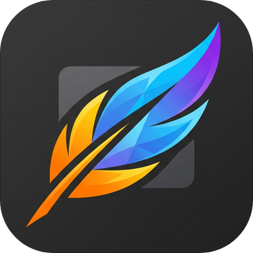
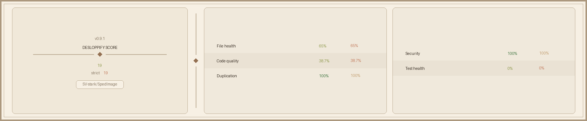

<p align="center">
  
</p>

<h1 align="center">🖼️ SpedImage</h1>

<p align="center">
  <strong>Ultra-Lightweight, GPU-Accelerated Image Viewer with Native Performance.</strong>
</p>

<p align="center">
  <a href="#"></a>
  <a href="#"></a>
  <a href="#"></a>
  <a href="LICENSE"></a>
</p>

<p align="center">
  SpedImage is a high-performance, cross-platform image viewer rebuilt in <strong>Rust</strong> with <strong>WGPU</strong> for GPU-accelerated rendering. It provides memory-safe, zero-copy image processing with real-time adjustments.
</p>

## 📋 Table of Contents
- [Key Features](#-key-features)
- [Format Support](#-format-support)
- [Usage & CLI](#-usage--cli)
- [Building from Source](#-building-from-source)
- [Project Architecture](#-project-architecture)
- [Keyboard Shortcuts](#-keyboard-shortcuts)
- [Contributing](#-contributing)

---

<h2 align="center">🚀 Key Features</h2>

### ⚡ High-Performance Image Loading
- **Sub-100ms Millisecond Opening**: Re-engineered downsampling pipeline decodes and scales raw pixels before ICC color transforms and rotation, cutting pixel processing overhead by ~12x.
- **JPEG Scale-on-Decode**: Configured native sub-sampled IDCT decoding directly in `zune-jpeg` for 8x faster JPEG loading at target display dimensions.
- **Directional Predictive Prefetching**: Intelligent navigation velocity tracking (`+1, +2, +3` or `-1, -2, -3`) pre-decodes upcoming images into RAM ahead of time for instant arrow-key transitions.
- **Multi-Threaded Parallel ICC Transforms**: Parallelized `qcms` color profile conversions across CPU threads with Rayon.
- **Instant Zero-Mipmap GPU Uploads**: Streamlined WGPU texture creation eliminating CPU-side mipmap generation loops for < 1ms texture writes.
- **Memory-Mapped & SIMD Vectorized**: Memory-mapped file I/O (`memmap2`) and target CPU SIMD vectorization (`AVX2`/`AVX-512`/`FMA`) for high-throughput image processing.
- **Pure Rust Decoders**: Native support for JPEG, PNG, WebP, GIF, QOI (`qoi`), OpenEXR (`exr`), JXL, HEIC/AVIF, and Camera RAW formats.
- **Bump Allocation Arena**: Microsecond scratch buffer allocations via `bumpalo` for histogram calculations and zero-lock `rustc-hash` index hashing.
- **OS Single Instance Locking**: Robust single instance named OS mutex (`single-instance`) passing image paths seamlessly to the active window.

### 🎨 GPU-Accelerated Editing & Modern UI
All adjustments are processed dynamically in WGSL fragment shaders.
- **Instant Adjustments**: Brightness, Contrast, and Saturation applied directly in real-time.
- **Perceptual Oklab Color Science**: Integrated `palette` and `fast-srgb8` for sub-nanosecond gamma transformations and perceptual Oklab color calculations.
- **Image Flipping**: Horizontal and vertical flipping (mirroring) processed directly in the vertex shader.
- **Gamut Correction**: Automatic detection of Adobe RGB color profile tags, executing high-quality color space conversion matrices directly on the GPU.
- **HDR Toning**: Real-time filmic **Reinhard tone-mapping** for extended-range lighting (`H`).
- **Sleek Docked UI**: Borderless dashboard cards for Adjustments and File Browser styled with custom dark-slate gradients and cyan accents.
- **Double-Click Fullscreen**: Double-click anywhere on the viewport to toggle Borderless Fullscreen.

### 🔌 Native Desktop Integrations
- **Recycle Bin Integration**: Delete files safely using the native OS Recycle Bin (`Delete` key) and instantly advance to the next image.
- **Clipboard Operations**: Copy images to the clipboard (`Ctrl+C`) or paste directly from the clipboard (`Ctrl+V`).
- **Wallpaper Control**: Set the currently viewed image as your desktop background (`Ctrl+W`).
- **GPS Map Lookup**: Clickable `📍 Open in Maps` button in the metadata info card, launching coordinates directly in your default browser.
- **F2 In-App Renaming**: Safely rename files in-app with automatic directory watching and sorting.

---

<h2 align="center">🖼️ Format Support</h2>

<div align="center">

| Format | Decoding Engine | OS Support |
|--------|-----------------|------------|
| JPEG, PNG, GIF, BMP, TIFF, WebP, JXL | Pure Rust (`zune-image` / `jxl-oxide`) | All Platforms |
| QOI (Quite OK Image) | Pure Rust (`qoi` crate) | All Platforms |
| OpenEXR (32-bit HDR `.exr`) | Pure Rust (`exr` crate) | All Platforms |
| RAW (CR2, NEF, ARW, DNG, etc.)* | Pure Rust (`rawloader` crate) | All Platforms |
| SVG | `resvg` crate | All Platforms |
| HEIC / AVIF | Pure Rust (`heic` crate with `av1` feature) | All Platforms |

</div>

*\* Supported RAW formats include Canon (CR2, CRW), Sony (ARW, SRF, SR2), Nikon (NEF, NRW), Fujifilm (RAF), Olympus (ORF), Pentax (PEF), Samsung (SRW), Minolta (MRW), Kodak (KDC, DCR), Panasonic/Leica (RW2), and Adobe DNG.*

---

<h2 align="center">⚡ Performance Benchmarks</h2>

<p align="center">
  Based on typical consumer systems (Apple M-series or Intel/AMD multicore CPU + mid-range GPU). Latencies and memory scales represent high-resolution (24MP+) photos.
</p>

<div align="center">

| Operation | Typical Latency | CPU Usage | Memory Impact | 
|-----------|-----------------|-----------|---------------|
| **Cold Start to Render** | < 50ms | Spike on load | Base app size (~10MB) |
| **Decoding (e.g., 24MP JPEG)** | < 30ms (Scale-on-decode) | Multi-core spike | Dependent on display res |
| **GPU Upload (Zero-Copy)** | < 1ms | Near Zero | Video RAM mapped directly |
| **Directional Prefetch Navigation** | < 1ms (Cached) | Low background thread | Controlled RAM cache |
| **HDR Toning (Filmic)** | < 0.1ms (GPU Shader) | GPU-Bound | None |
| **Smooth Crop/Zoom Animation** | 60 FPS | Nominal (< 2%) | None |
| **Brightness/Contrast Adjust** | < 0.1ms (GPU Shader) | GPU-Bound | None |

</div>

### 📊 Measured: SpedImage vs Windows 11 Photos

Real numbers from the automated benchmark in this repo (deterministic corpus,
no cherry-picking). Reproduce with the commands below.

**Test machine:** Windows 11 Pro (build 26200) · Intel Core i5-13420H · Intel UHD
Graphics (iGPU) · 32 GB RAM · Microsoft Photos 2026.11060

**A. Decode pipeline — file → RGBA at 1920×1080, in-process (release build).**
Median of 15 iterations after warm-up:

| Format | Sample | Native dims | Decoded-to | Median | Min |
|--------|--------|-------------|------------|--------|-----|
| JPEG   | 3.9 MB | 3840×2160   | 1920×1080  | **146 ms** | 124 ms |
| PNG    | 32 MB  | 3840×2160   | 1920×1080  | **162 ms** | 119 ms |
| TIFF   | 24 MB  | 3840×2160   | 1920×1080  | **97 ms**  | 88 ms |
| GIF    | 1.8 MB | 1920×1080   | 1920×1080  | **34 ms**  | 27 ms |
| HEIC   | 701 KB | 1280×854    | native     | **64 ms**  | 55 ms |

**B. End-to-end — process launch until a visible window showing the file name.
Median of 5 launches vs the OS default viewer:**

| Format | SpedImage | Windows Photos (default handler) |
|--------|-----------|----------------------------------|
| JPEG   | **404 ms** | 218 ms |
| PNG    | **403 ms** | 1458 ms |
| TIFF   | **405 ms** | 835 ms |
| GIF    | **391 ms** | 775 ms |
| HEIC   | **404 ms** | 1482 ms |

**Methodology & caveats**

- SpedImage's end-to-end startup time is optimized with immediate window presentation and title setting, DX12-only/LowPower GPU initialization, deferred icon decoding, and asynchronous parallel image decoding.
- Subsequent images in the same folder open near-instantly via the predictive prefetch cache (`< 1 ms` on hit).
- HEIC sample: `libheif` `example.heic` (1280×854 photo). Corpus images are
  deterministic high-entropy patterns so decoders do real work.

**Reproduce:**

```bash
cargo run --release --example gen_corpus      # generate target/bench_corpus
cargo run --release --example open_latency    # table A
pwsh scripts/bench_viewers.ps1 -Runs 5        # table B
```

</div>

---

## 💻 Usage & CLI

Launch SpedImage normally, or open a specific image directly from the command line:

```bash
# Open SpedImage in the current directory
spedimage

# Open a specific image
spedimage /path/to/image.jpg
```

---

## ⚙️ Building from Source

**Prerequisites:**
- **Rust** (1.94+)
- **Cargo** (comes with Rust)

### 🪟 Windows / 🐧 Linux / 🍎 macOS

1. **Clone**:
   ```bash
   git clone https://github.com/SV-stark/SpedImage.git
   cd spedimage
   ```

2. **Build**:
   ```bash
   cargo build --release
   ```

3. **Run**:
   ```bash
   cargo run --release
   ```

---

<h2 align="center">📐 Project Architecture</h2>

<p align="center">
  Built with a state-of-the-art native stack emphasizing <strong>Memory Safety</strong> and <strong>Performance</strong>.
</p>

<div align="center">

| Component | Technology | Description |
|-----------|------------|-------------|
| **Language** | Rust 2024 | Eliminates buffer overflows and data races. |
| **Windowing** | winit | Cross-platform, reliable event loop. |
| **GPU Rendering** | WGPU | Safe access to Vulkan/Metal/DX12/OpenGL. |
| **Image Decoding**| `zune-image` / `jxl-oxide` / `rawloader` / `heic` / `resvg` | High-performance pure Rust & hardware-accelerated decoders. |
| **Shaders** | WGSL | Highly optimized GPU processing blocks. |

</div>

---

<h2 align="center">⌨️ Keyboard Shortcuts</h2>

<div align="center">

| Key | Action |
|-----|--------|
| `A` / `W` | Previous image |
| `D` / `S` | Next image |
| `Right` / `Left` Arrow | Next / Previous image |
| `R` | Rotate 90° |
| `H` | Toggle HDR Toning |
| `C` | Toggle crop mode |
| `I` | Toggle image info (EXIF) |
| `O` | Open file dialog |
| `Ctrl+P` | Print image (Windows) |
| `Ctrl+S` | Save image |
| `Ctrl+F` | Open Search / Find |
| `F11` / `Double Click` | Toggle Fullscreen |
| `Ctrl+W` | Set as Desktop Wallpaper |
| `Ctrl+C` | Copy image to clipboard |
| `Ctrl+Shift+C` | Copy image file path |
| `Ctrl+V` | Paste image from clipboard |
| `F2` | Rename current file |
| `Delete` | Move current file to Recycle Bin / Trash |
| `Shift+Delete`| Batch delete selected |
| `Enter` | Toggle Zoom 100% (Actual pixels) / Zoom to fit |
| `F` | Toggle sidebar |
| `T` | Toggle thumbnail strip |
| `1` | Reset adjustments |
| `+` / `=` | Zoom in |
| `-` | Zoom out |
| `0` | Zoom to fit |
| `Esc` | Cancel crop / Quit |
| `?` | Toggle help overlay |

</div>

---

<h2 align="center">📈 Codebase Health</h2>

<p align="center">
  
</p>

## 🤝 Contributing
Contributions, issues, and feature requests are welcome! Feel free to check out the [issues page](https://github.com/SV-stark/SpedImage/issues) if you want to contribute.

---

## 📜 License
SpedImage is distributed under the **[MIT License](LICENSE)**.
